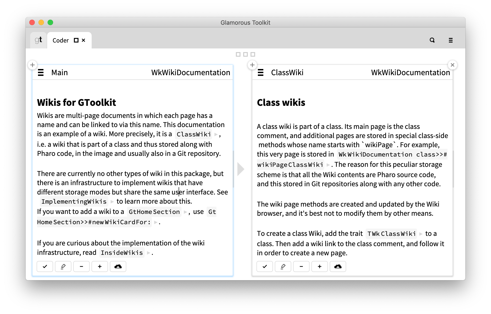

# A Wiki infrastructure for the GToolkit environment

This package adds multi-page Wikis to the [Glamorous Toolkit](https://gtoolkit.com).



Its core is an abstract Wiki class and a Wiki browser building on its API. Different Wikis with different data storage modes can then be implemented as subclasses. For now only one concrete Wiki implementation is provided, which adds a documentation Wiki to a class.

For documentation, see the class `WkWikiDocumentation`.

## Installation

Execute the following code snippet in a playground (GToolkit or a plain Pharo 8 image):
```
Metacello new
    baseline: 'WikiForGToolkit';
    repository: 'github://khinsen/WikiForGToolkit';
	 onConflictUseLoaded;
    load.
```

Note that installation in a plain Pharo image will also install GToolkit, a process that is likely to take 20 to 30 minutes. It is much more efficient to download a prebuilt GToolkit image and install this package on top of it.
